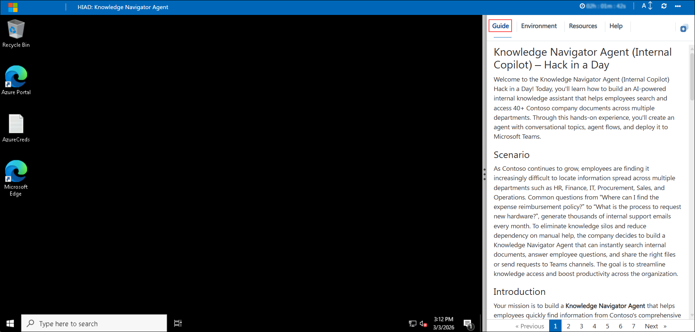
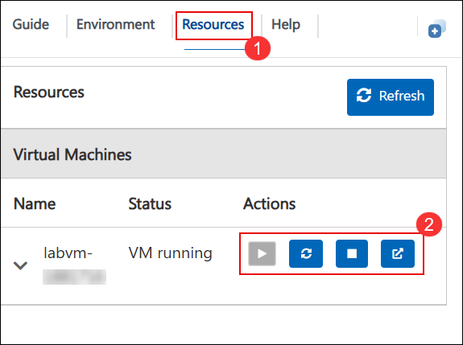
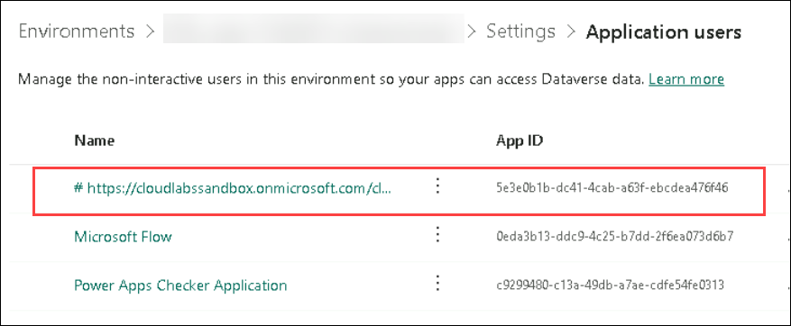
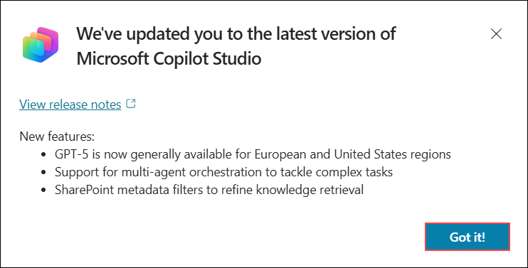
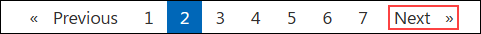

## Getting Started with Your Lab

Welcome to Hack in a Day: Knowledge Navigator Agent (Internal Copilot)! We've prepared a complete environment with Contoso company documents ready for you to build an AI-powered knowledge assistant. Let's begin by setting up your workspace.

### Accessing Your Challenge Environment

Once you're ready to dive in, your virtual machine and challenge guide will be right at your fingertips within your web browser.



### Exploring Your Challenge Resources

To get a better understanding of your challenge resources and credentials, navigate to the Environment tab.


### Utilizing the Split Window Feature

For convenience, you can open the challenge guide in a separate window by selecting the Split Window button from the top right corner.


### Managing Your Virtual Machine

Feel free to start, stop, or restart your virtual machine as needed from the Resources tab. Your experience is in your hands!



## Let's Get Started with Copilot Studio

1. In the JumpVM, click on the **Microsoft Edge** browser shortcut on the desktop.

   

1. Open a new browser tab and navigate to the Power Platform admin center by entering the following URL:

   ```
   https://admin.powerplatform.microsoft.com
   ```

1. On the **Sign into Microsoft** tab, enter the following email **(1)** in the email field, and then click **Next (2)** to proceed.

   - Email: **<inject key="AzureAdUserEmail"></inject>**

     

1. On the **Enter Temporary Access Pass** screen, enter the following **Temporary Access Pass**, and then click **Sign in (2)**.

   - Temporary Access Pass: **<inject key="AzureAdUserPassword"></inject>**

     
     
1. If you see the pop-up **Stay Signed in?**, click **No**.

   

1. In the **Power Platform admin center**, select **Manage (1)**, choose **Environments (2)**, and then click **ODL_User <inject key="DeploymentID" enableCopy="false"/>'s Environment (3)**.

   

   >Note: Please note that you may occasionally see a temporary portal error during this step. This is a known behavior in the Power Platform and does not impact the environment creation process. If it appears, simply close the browser window of Power Platform.

   >Environment provisioning can take up to 15 minutes, especially during periods of high usage. While this is in progress, you can proceed to Challenge 2, download the dataset, and prepare it for the next steps. By the time you're done, your environment should be ready.

1. In the environment page, click on **See all** under **S2S apps**.

   

1. In the next pane, click on **+ New app user**.

   

1. On this page, check whether `https://sandboxailabs1001.onmicrosoft.com/cloudlabs.ai` is already added. **If present, skip to Step 17.** Otherwise, proceed with the steps below.

   

1. In the create a new app user pane, under **App**, click on **+ Add an app**.

   

1. In the **Add an app from Microsoft Entra ID** pane, enter `https://sandboxailabs1001.onmicrosoft.com/cloudlabs.ai` in the search box **(1)**, select whichever app is available from the results **(2)**, and then click **Add (3)**.

   

1. Under **Business unit**, select the available business unit from the list **(2)**.

   

1. Beside **Security roles** click on **Edit** icon.

   

1. In the **Sync Permissions** pane, select **System Administrator (1)**, and then click **Save (2)**.

   

1. In the pop-up window, select **save**.

   

1. Review all the details and click on **Create**.

   

1. Navigate to **Microsoft Copilot Studio** by opening a new browser tab and entering the following URL:

   ```
   https://copilotstudio.microsoft.com
   ```

1. On the **Welcome to Microsoft Copilot Studio** screen, keep the default **country/region** selection and click **Get Started** to continue.

   

1. If the **Welcome to Copilot Studio!** pop-up appears, click **Skip** to continue to the main dashboard.

   

1. If the **We've updated you to the latest version of Microsoft Copilot Studio** pop-up appears, click **Got it!**.

   

1. If the **What's new in Copilot Studio** pop-up appears, click the **Close (X)** icon to dismiss it.

   

1. In Copilot Studio, open the environment picker **(1)**, expand **Supported environments (2)**, and select **ODL_User <inject key="Deployment ID" enableCopy="false"></inject>'s Environment (3)** to switch.

   

1. You are now ready to start building your **Knowledge Navigator Agent** using Microsoft Copilot Studio.

Click **Next** at the bottom of the page to proceed to the next page.

   
